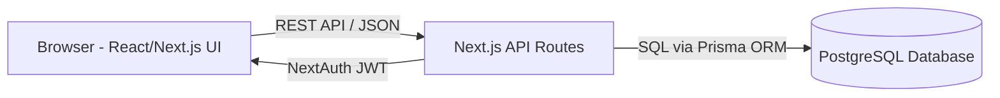

# Tech Stack Document
## Mobile Shop — Inventory, Billing & Sales Analytics System

**Version:** 1.0 (Draft for Review)

---

## 1. Architecture Overview

A unified full-stack architecture optimized for fast development and simple deployment. Both frontend and backend run as a single Next.js application, eliminating deployment complexity and context switching.



- **Frontend:** React 18 components with Server-Side Rendering where beneficial via Next.js.
- **Backend:** Next.js API Routes (`/api`) contain all business logic (authentication, stock deduction, billing transactions).
- **Database:** PostgreSQL — relational structure ensures ACID transactions for critical inventory operations (stock counts must never go negative or desync).

## 2. Recommended Stack

| Layer | Technology | Why |
|---|---|---|
| **Frontend** | **Next.js 14** + **React 18** | Server-side rendering for fast page loads, built-in routing with App Router, API routes eliminate separate backend server |
| **Styling** | **Tailwind CSS** | Rapid development of minimal UI without custom CSS, design consistency with utility classes |
| **Charts & Graphs** | **Recharts** | Lightweight, React-native library perfect for monthly sales analysis visualizations |
| **Backend** | **Next.js API Routes** | All business logic in `/api` routes — type-safe with TypeScript, no separate service to deploy |
| **Database** | **PostgreSQL** | ACID-compliant transactions ensure stock counts never desync during concurrent sales; relational structure matches inventory data naturally |
| **ORM** | **Prisma** | Type-safe queries with auto-generated TypeScript client, atomic transactions, versioned migrations, zero boilerplate |
| **Auth** | **NextAuth.js** (Credentials Provider) | Built-in JWT sessions, simple username/password login, role claims (`owner` / `staff`) in token — minimal setup |
| **Database Client** | **Supabase** (free tier) or **Local PostgreSQL** | Supabase = zero setup (hosted Postgres), free tier sufficient; local = full control in development |
| **Printing** | **react-to-print** | Trigger browser print dialog for invoices; no separate print server needed |
| **Containerization** | **Docker** | Optional; one `docker-compose.yml` for local Postgres if not using Supabase |
| **Testing** | **Jest** + **React Testing Library** (frontend), **API route tests** | Catch business logic bugs (especially stock deduction) before production |
| **CI/CD** | **GitHub Actions** | Run tests on every push; Vercel auto-deploys on merge to main |
| **Hosting** | **Vercel** (frontend + backend) + **Supabase** (database) | Single deployment URL, auto-scaling free tier, one-click rollbacks |

**Why This Stack (vs. Separate FastAPI Backend):**
- ✅ Single deployment → one URL, one CI/CD pipeline
- ✅ One language (TypeScript/JavaScript) → no context switching
- ✅ Faster local setup → `npm install` + Postgres only
- ✅ Prisma atomic transactions are as safe as SQLAlchemy
- ✅ NextAuth.js JWT is equally secure
- ✅ Vercel's free tier handles single-shop load effortlessly
- ✅ Easier maintenance for one developer or a small team

## 3. API Design (Next.js API Routes)

REST JSON endpoints under `/api/v1/`. Each route is a file in the `app/api/v1/` directory.

| Endpoint | Method | Purpose | Access |
|---|---|---|---|
| `/api/v1/auth/login` | POST | Authenticate via username/password, return JWT session | Public |
| `/api/v1/categories` | GET/POST | List/create categories | Owner (write), All (read) |
| `/api/v1/products` | GET/POST/PATCH | List/create/update products | Owner (write), All (read) |
| `/api/v1/products/[id]/stock-in` | POST | Add stock (quantity or IMEI list) | Owner |
| `/api/v1/products/[id]/units` | GET | List serial units & status for a product | Owner |
| `/api/v1/bills` | POST | Create a new bill (transactional stock deduction) | Owner, Staff |
| `/api/v1/bills/[id]` | GET | Fetch a bill for viewing/printing | Owner, Staff |
| `/api/v1/bills/[id]/void` | POST | Cancel a bill, restore stock | Owner |
| `/api/v1/analytics/monthly` | GET | Monthly revenue, units sold, breakdown | Owner |
| `/api/v1/users` | GET/POST | Manage staff accounts | Owner |

**Middleware & Security:**
- NextAuth.js session validation on every request
- Role-based access control enforced at the route handler level
- Cost price and profit fields **excluded from responses** for staff-role sessions in the middleware layer — not just hidden in the frontend
- Prisma ORM prevents SQL injection; request validation via TypeScript types

## 4. Suggested Modular Folder Structure

This structure separates concerns by domain (Auth, Products, Bills, Analytics) while keeping frontend and backend together in one Next.js project.

```
mobile-shop/
├── .env.local                 # Environment variables (DB URL, NextAuth secret)
├── prisma/
│   ├── schema.prisma          # Database schema (Prisma models)
│   └── migrations/            # Auto-generated migration files
│
├── app/
│   ├── layout.tsx             # Root layout
│   ├── page.tsx               # Dashboard (home)
│   ├── api/
│   │   └── v1/
│   │       ├── auth/
│   │       │   ├── login/route.ts           # POST /api/v1/auth/login
│   │       │   └── logout/route.ts          # POST /api/v1/auth/logout
│   │       ├── categories/
│   │       │   ├── route.ts                 # GET/POST /api/v1/categories
│   │       │   └── [id]/route.ts            # GET/PATCH /api/v1/categories/[id]
│   │       ├── products/
│   │       │   ├── route.ts                 # GET/POST /api/v1/products
│   │       │   ├── search/route.ts          # GET /api/v1/products/search
│   │       │   ├── [id]/
│   │       │   │   ├── route.ts             # GET/PATCH /api/v1/products/[id]
│   │       │   │   ├── stock-in/route.ts    # POST /api/v1/products/[id]/stock-in
│   │       │   │   └── units/route.ts       # GET /api/v1/products/[id]/units
│   │       ├── bills/
│   │       │   ├── route.ts                 # GET/POST /api/v1/bills
│   │       │   └── [id]/
│   │       │       ├── route.ts             # GET /api/v1/bills/[id]
│   │       │       └── void/route.ts        # POST /api/v1/bills/[id]/void
│   │       ├── analytics/
│   │       │   └── monthly/route.ts         # GET /api/v1/analytics/monthly
│   │       ├── users/
│   │       │   └── route.ts                 # GET/POST /api/v1/users
│   │       └── _middleware/                 # Auth & RBAC middleware
│   │           ├── auth.ts                  # NextAuth setup & session validation
│   │           └── rbac.ts                  # Role-based access control
│   │
│   ├── (auth)/                              # Auth pages (not visible in URL)
│   │   └── login/
│   │       └── page.tsx
│   │
│   ├── (dashboard)/                         # Protected dashboard pages
│   │   ├── dashboard/
│   │   │   └── page.tsx                     # Owner/Staff home screen
│   │   ├── inventory/
│   │   │   ├── page.tsx                     # Stock list
│   │   │   ├── add-stock/page.tsx           # Add stock form
│   │   │   └── [id]/page.tsx                # Product detail
│   │   ├── billing/
│   │   │   ├── page.tsx                     # Billing screen
│   │   │   ├── cart/page.tsx                # Bill preview
│   │   │   └── history/page.tsx             # Bill history
│   │   ├── analytics/
│   │   │   └── page.tsx                     # Monthly sales dashboard
│   │   └── staff-management/
│   │       └── page.tsx                     # Manage staff (owner only)
│   │
│   └── layout.tsx                           # Protected layout (auth guard)
│
├── components/                              # Reusable React components
│   ├── auth/
│   │   ├── LoginForm.tsx
│   │   └── LogoutButton.tsx
│   ├── inventory/
│   │   ├── ProductList.tsx
│   │   ├── AddStockForm.tsx
│   │   ├── LowStockAlert.tsx
│   │   └── CategoryFilter.tsx
│   ├── billing/
│   │   ├── ProductSearch.tsx
│   │   ├── BillCart.tsx
│   │   ├── BillPreview.tsx
│   │   └── CustomerInfo.tsx
│   ├── analytics/
│   │   ├── RevenueChart.tsx
│   │   ├── CategoryBreakdown.tsx
│   │   ├── TopProducts.tsx
│   │   └── MonthSelector.tsx
│   ├── ui/                                  # Generic UI components
│   │   ├── Button.tsx
│   │   ├── Modal.tsx
│   │   ├── Card.tsx
│   │   ├── Badge.tsx
│   │   └── Table.tsx
│   └── layout/
│       ├── Navbar.tsx
│       └── Sidebar.tsx
│
├── lib/                                     # Utility functions & helpers
│   ├── prisma.ts                            # Prisma client singleton
│   ├── auth.ts                              # NextAuth configuration
│   ├── api-client.ts                        # Fetch helper for /api routes
│   ├── validators.ts                        # Input validation (stock quantity, IMEI, etc.)
│   ├── utils.ts                             # General helpers (formatting, calculations)
│   └── db-transactions.ts                   # Helper functions for atomic DB operations
│
├── types/                                   # TypeScript types & interfaces
│   ├── models.ts                            # Mirrors Prisma schema (User, Product, Bill, etc.)
│   ├── api.ts                               # API request/response types
│   └── auth.ts                              # Auth context types
│
├── hooks/                                   # Custom React hooks
│   ├── useAuth.ts                           # Auth context hook
│   ├── useProducts.ts                       # Fetch/mutate products
│   ├── useBills.ts                          # Fetch/create/void bills
│   └── useAnalytics.ts                      # Fetch monthly analysis data
│
├── styles/
│   └── globals.css                          # Tailwind imports
│
├── __tests__/                               # Jest test files (mirrors src structure)
│   ├── api/
│   │   ├── bills.test.ts                    # Test stock deduction transaction
│   │   ├── products.test.ts
│   │   └── analytics.test.ts
│   └── components/
│       ├── BillCart.test.tsx
│       └── ProductSearch.test.tsx
│
├── package.json
├── tsconfig.json
├── next.config.js
├── tailwind.config.js
└── README.md
```

**Key Design Principles:**
1. **Grouped by Domain** — Auth, Products, Bills, Analytics each have their own folder in `/api` and `/components`
2. **Shallow Nesting** — 2–3 levels max, no deeply nested folders
3. **Shared Utilities** — `lib/`, `types/`, `hooks/` are reused across all pages/routes
4. **Type Safety** — All Prisma models auto-generate TypeScript types; API routes are fully typed
5. **RBAC Enforced Server-Side** — Middleware in `/api/_middleware/` checks role before any route handler runs
6. **Atomic Transactions** — Complex operations (stock deduction) live in `lib/db-transactions.ts` and are called from route handlers

## 5. Why Not Alternatives

- **Separate Backend (FastAPI/Node.js):** Would require managing 2 deployments, 2 services, 2 databases on separate hosts. Overkill for a single-shop system. Next.js API Routes give you the same security & performance with half the operational burden.
- **MongoDB instead of PostgreSQL:** Inventory/billing is textbook relational (foreign keys, joins, transactions). A document DB would force you to re-build relational integrity by hand — more code, more bugs, more risk of stock-count desynchs.
- **React Router / Vite instead of Next.js:** Both work fine for a UI this size. Next.js is chosen for built-in routing, file-based structure, and simpler deployment to Vercel.
- **Tailwind alternatives (Bootstrap, Material-UI):** Both work. Tailwind is lighter, faster to customize for a minimal design, and has great documentation.

These are genuinely close calls — the key decision is **one unified Next.js app** (simpler deployment, faster iteration) vs. **separate backend** (only if you had multiple frontends or a large team), and this project doesn't need the latter.
