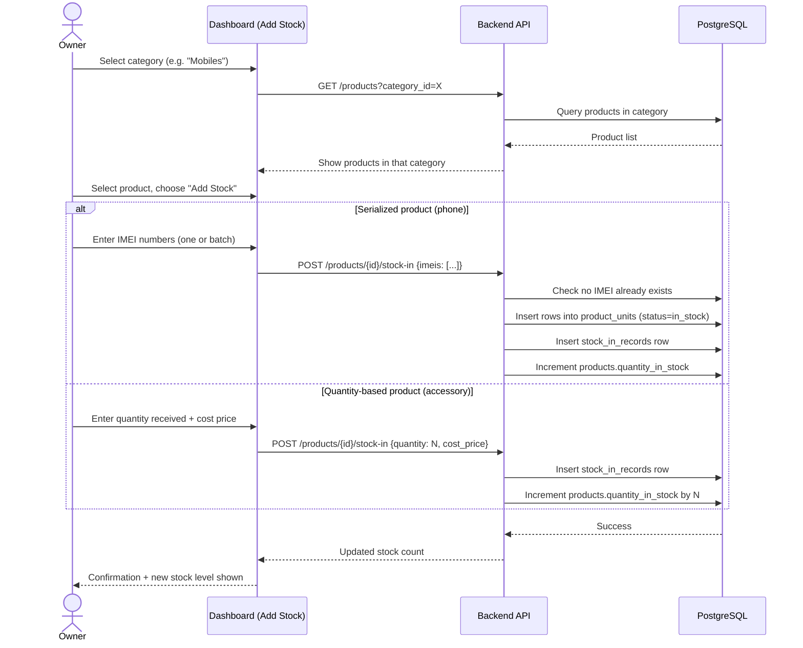
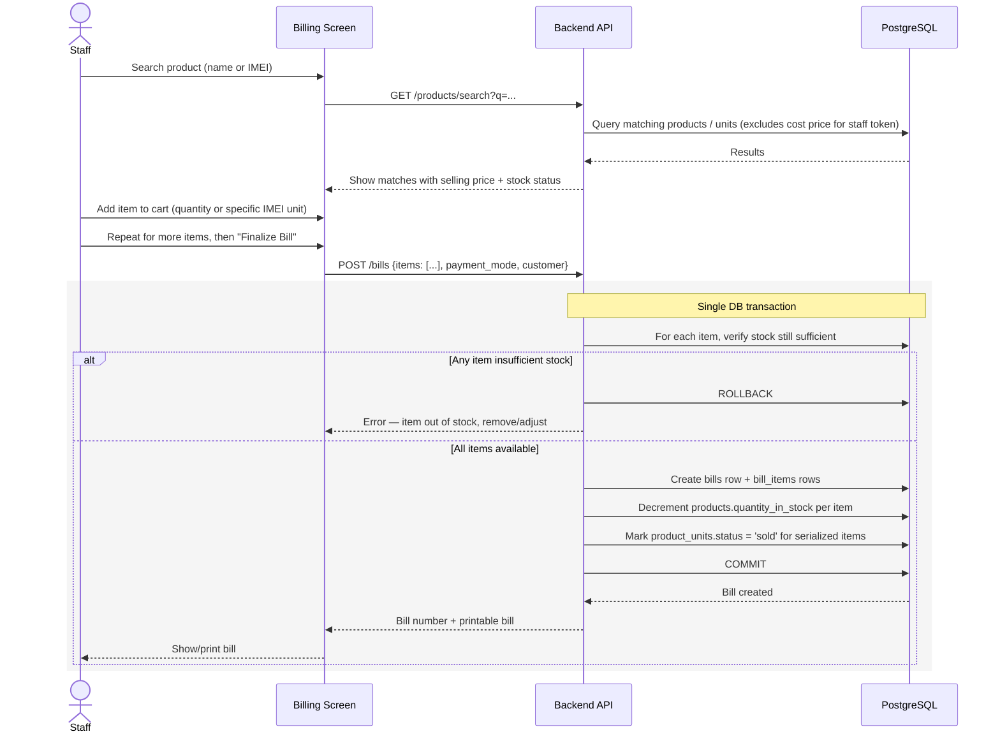
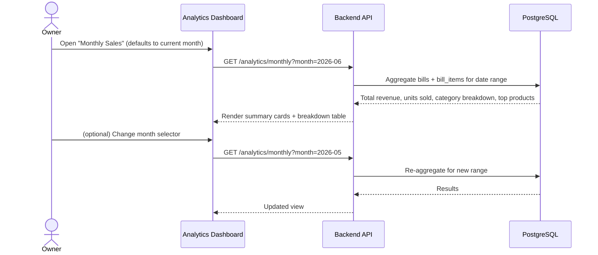
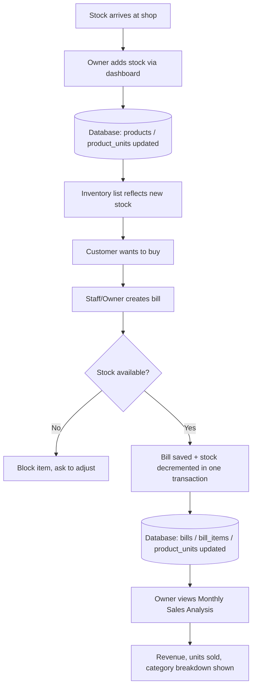

# Data Flow Document
## Mobile Shop — Inventory, Billing & Sales Analytics System

**Version:** 1.0 (Draft for Review)

---

## 1. Actors

- **Owner** — full access, including stock management and analytics.
- **Staff** — billing only, read-only stock visibility, no cost-price visibility.
- **System** — enforces validation and transactional integrity in the backend.

## 2. Flow 1 — Adding New Stock (Category-wise)

**Key rule:** the dashboard always asks for category → product → quantity/IMEI, in that order, so the owner never has to search through an unfiltered product list.

## 3. Flow 2 — Generating a Bill (Sale)

**Key rule:** stock check and stock deduction happen in the *same* transaction as bill creation. This guarantees the system can never show a bill as "completed" while leaving stock counts wrong — either everything succeeds together, or nothing is saved.

## 4. Flow 3 — Monthly Sales Analysis

This is read-only and always reflects live data — there's no separate "generate report" button, since the underlying query runs directly against `bills`/`bill_items` whenever the owner opens the screen.

## 5. Edge Cases & How They're Handled

| Scenario | Handling |
|---|---|
| Staff tries to sell an item with 0 stock | Blocked at both UI (item shown as "Out of stock") and API (transaction check) — never relies on UI alone |
| Two staff members try to sell the last unit of a phone at the same time | Database transaction + row-level check ensures only one bill succeeds; the second gets an "out of stock" error and must adjust the cart |
| Owner needs to cancel a bill made by mistake | `POST /bills/{id}/void` reverses stock deduction (increments quantity back / sets unit status back to `in_stock`) and marks the bill `voided`, but keeps the original row for audit history rather than deleting it |
| Duplicate IMEI entered during stock-in | Rejected at the database level (unique constraint) with a clear error message naming the conflicting IMEI |
| Low stock threshold reached | Flagged on the inventory list and owner's dashboard; does not block sales, just alerts |

## 6. Data Flow Summary Diagram (System-Level)

